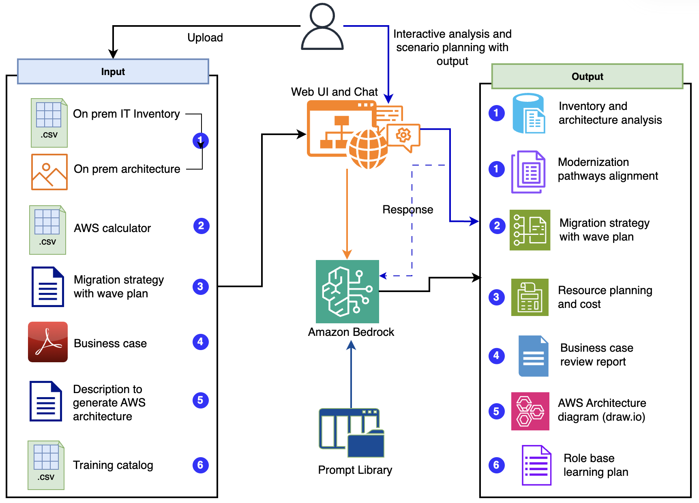

# AWS Migration Acceleration Program (MAP) - Gen AI Use Cases

## Overview
This sample repository illustrates the application of Generative AI (Gen AI) during the AWS Migration Acceleration Program (MAP) assessment phase, after the completion of on-premises discovery. It showcases capabilities that enhance migration planning, cost optimization, identification of modernization opportunities, and resource planning—processes which were previously both time-consuming and complex.This repository showcases seven integrated capabilities that address the most challenging aspects during the migration strategy and execution.


## Features

### 1. Modernization Opportunity Analysis

- Analyzes on-premises architecture and infrastructure data
- Identifies [modernization pathways](https://aws.amazon.com/blogs/migration-and-modernization/move-to-ai-pathway/) with corresponding AWS cost projections
- Supports CSV inventory data and architecture image analysis
- Provides AWS service recommendations

### 2. Migration Strategy Development

- Processes AWS Calculator CSV exports
- Creates data-driven migration patterns and wave planning
- Generates cumulative spend forecasts and $50k milestone predictions
- Accelerates migration timeline development

### 3. Resource Planning

- Develops detailed team structures and resource allocation plans
- Provides five key outputs:
  - Executive summary
  - Team structure evaluation (Hub-and-Spoke and Wave-Based team)
  - Resource summary
  - Wave-based planning
  - Role-based resource allocation

### 4. Learning Pathway Development

- Creates personalized training and skill development plans for AWS migration teams
- Provides role-based learning recommendations (Solution Architect, Software Developer, Delivery Manager, Alliance Lead, Sales and Marketing)
- Generates experience-level specific pathways (Junior, Senior, Principal levels)
- Integrates with training catalog CSV files to provide direct course links
- Provides customizable learning duration planning

### 5. Business Case Review

- Comprehensive AWS TCO (Total Cost of Ownership) analysis and validation
- PDF document processing for business case evaluation
- Reviews seven critical elements for accurate cost modeling:
  - Input collection and infrastructure assessment
  - Multi-year cost modeling with various scenarios
  - Business value quantification (tangible and intangible benefits)
  - Optimization strategies and right-sizing recommendations
  - Comparative analysis between on-premises and AWS costs
  - Ongoing cost management and governance frameworks
  - Holistic cloud value assessment
- Supports up to 10 pages of PDF analysis

### 6. Architecture Diagram Generator

- AWS architecture diagram generation using text-based descriptions in Draw.io XML format
- Creates diagrams with proper AWS service icons and styling
- Generates editable .drawio files compatible with [draw.io](https://app.diagrams.net/)
- Includes AWS resource icon patterns with standardized styling


### 7. Interactive Analysis Chat & Scenario Exploration

- Context-aware conversational and scenario exploration with generated output:
  - Inventory Analysis discussions and what-if scenarios
  - Modernization Recommendations exploration
  - On-Premises Architecture insights and transformation options
  - Migration Strategy clarifications and timeline adjustments
  - Resource Planning consultations and capacity modeling
- Integrates with [Mem0](https://docs.mem0.ai/integrations/aws-bedrock) for persistent conversation memory with intelligent context retrieval using default vector store configuration. Memory persists during the session with local storage (resets when application restarts)
- Requires processing output of use cases before context becomes available

### 8. Prompt Library

The Prompt Library is a collection of prompts designed to accelerate their Gen AI adoption across migration and modernization phase. It includes a structured prompt library with pre-built templates for each use case. These templates are designed to be reviewed and tailored to your specific requirements.

#### Modernization Cost and Analysis Prompts

- **Inventory Analysis Template**: High level IT inventory analysis across multiple technology domains
- **Modernization Pathways Template**: AWS Cost inline with modernization pathways approaches with customizable AWS service preferences and cost estimation parameters
- **Architecture Analysis Template**: Processes on-premises architecture diagrams and provide analysis across key domains (compute, network, database, security and monitoring)

#### Migration Strategy Prompts

- Generates three migration approaches, compares patterns to identify consistent strategic elements and synthesizes optimal final strategy from cross-pattern analysis
- Creates structured migration waves and cost projection methodology
- Predicts $50,000 USD milestone achievement with adjustable acceleration strategies

#### Resource Planning Prompts

- Evaluates Hub-and-Spoke vs Wave-Based team models, calculates effort estimates using customizable utilization rates and team pod sizes, generates role-based resource allocation with adjustable contingency factors

#### Learning Pathway Prompts

- Role-specific training recommendations with experience level customization
- Integration with training catalogs for personalized learning paths
- Duration-based planning with skill progression tracking

#### Business Case Validation Prompts

- Comprehensive TCO analysis framework with seven critical evaluation elements
- Financial modeling templates for multi-year projections
- Business value quantification methodologies

#### Architecture Diagram Prompts

- AWS service icon pattern generation for Draw.io compatibility
- Standardized styling and connection templates
- Professional diagram layout optimization

> 💡 **Prompt Customization**: Review the README files in each `prompt_library/` subdirectory to understand default assumptions and learn how to customize prompts for your specific organizational requirements.

## High level process



**Input** → **Processing** → **Output Deliverables** → **Interactive Chat**

| **Process Stage** | **Components** |
|-------------------|----------------|
| **Input (Data Sources)** | • CSV: On-Premises IT Inventory<br>• Images: Architecture Diagrams<br>• CSV: AWS Calculator Export<br>• PDF: Business Case Documents<br>• MD: Migration Strategy<br>• CSV: Training Catalog |
| **Processing** | • Streamlit Web Interface (Landing Page & Chat)<br>• Prompt Library Templates<br>• Amazon Bedrock Models (Claude 3.7 Sonnet)<br>• Mem0 Memory Management (Context and Chat history) |
| **Output Deliverables** | **1. Modernization Opportunity** - Analysis & Pathways<br>• Inventory Analysis and on premises architecture analysis Report (.md)<br>• Modernization Strategy (.md)<br><br>**2. Migration Strategy** - Wave Planning & Costs<br>• Migration Strategy & Waves (.md)<br><br>**3. Resource Planning** - Team Structure, Allocation and Cost<br>• Resource Planning Document (.md)<br><br>**4. Business Case Review** - TCO Analysis & Validation<br>• Business Case Review Report (.md)<br><br>**5. Architecture Diagram** - Draw.io XML Generation<br>• Architecture Diagram (.drawio)<br><br>**6. Learning Pathway** - Role-based Training<br>• Learning Pathway Plan (.md) |
| **Interactive Chat Interface** | • Scenario Planning & Analysis<br>• Context-aware conversations with all generated outputs |

## Technology Stack

- **Frontend**: Streamlit for interactive web interface and conversation with generated outputs
- **LLM Model**: Amazon Bedrock with Claude 3.7 Sonnet for primary analysis and memory operations
- **Data and Image Processing**: Pandas, PyMuPDF for document processing
- **Memory Management**: Mem0 for persistent chat memory with default vector store configuration

## Utils Folder Structure

The `utils/` folder contains essential utility modules that provide core functionality across the application:

- **`config.py`**: Central configuration management with model settings, AWS region configuration, and specialized functions for chat and memory operations (`get_chat_model_config()`, `get_memory_model_config()`)
- **`file_handler.py`**: File processing utilities including CSV file reading (`read_csv_file()`), file size validation (`validate_file_size()`), and path management (`get_file_path()`)
- **`bedrock_client.py`**: Amazon Bedrock integration for AI model interactions (referenced in chat functionality)
- **`image_processor.py`**: Image processing utilities for architecture diagram analysis
- **`pdf_processor.py`**: PDF document processing for business case review functionality
- **`styles.css`**: External CSS styling loaded via `load_css()` function for consistent UI appearance

## Prerequisites

### AWS Requirements

- An [AWS account](https://aws.amazon.com/)
- Amazon Bedrock access with Claude model permissions in AWS region US East (N. Virginia) *us-east-1* for this code.
- [AWS Command Line Interface (AWS CLI)](https://aws.amazon.com/cli/)
- Python (version 3.8 or later)
- [AWS CLI configured](https://docs.aws.amazon.com/cli/v1/userguide/cli-chap-configure.html) to interact with AWS services using commands in command-line shell

### Additional Requirements for Chat Functionality

- Mem0 library for conversation memory management with default vector store configuration
- Enhanced memory processing using Claude 3.7 Sonnet for consistent context retrieval

## Quick Start

### 1. Clone the Repository

```bash
git clone <repository-url>
cd map-genai-usecases-aws-sample
```

### 2. Install Dependencies

```bash
pip install -r requirements.txt
```

### 3. Configure AWS Credentials

```bash
# Option 1: AWS CLI
aws configure

# Option 2: Environment Variables
export AWS_ACCESS_KEY_ID=your_access_key
export AWS_SECRET_ACCESS_KEY=your_secret_key
export AWS_DEFAULT_REGION=us-east-1
```

### 4. Amazon Bedrock Models

Ensure you have access to the following models in [Amazon Bedrock](https://docs.aws.amazon.com/bedrock/latest/userguide/models-supported.html):

- Anthropic Claude 3.7 Sonnet (`us.anthropic.claude-3-7-sonnet-20250219-v1:0`) - primary analysis model
- Amazon Titan Embed Text v2 (`amazon.titan-embed-text-v2:0`) - for embeddings and search

### 5. Review Configuration in utils/config.py

Before running the application, review the configuration settings in `utils/config.py`:

- **AWS Region**: Defaults to `us-east-1` (can be overridden via `AWS_REGION` environment variable)
- **Primary Model**: Claude 3.7 Sonnet (`us.anthropic.claude-3-7-sonnet-20250219-v1:0`) for main analysis tasks
- **Chat Model**: Dedicated chat configuration with optimized temperature (0.3) for consistent responses with real-time user interactions.
- **Memory Model**: Claude 3.7 Sonnet (`us.anthropic.claude-3-7-sonnet-20250219-v1:0`) for memory operations (background memory extraction, storage, and retrieval operations requiring high precision and deterministic behavior). The lower temperature (0.2) for precise memory extraction and factual information processing.
- **Timeout Settings**: 5-minute read timeout, 60-second connection timeout
- **File Processing**: Supports PNG images and CSV data files
- **Sample Data**: Resource profile template available at `sampledata/resource_profile_template.csv`

**Chat Configuration & Memory Management**:
- **Mem0 Integration**: The mem0ai package automatically includes qdrant-client as a dependency, eliminating the need for separate installation. The qdrant-client library runs in local embedded mode by default, allowing vector storage operations without requiring a separate Qdrant server setup. This embedded approach is ideal for prototyping scenarios to test vector database functionality without infrastructure overhead. For [production scenario](https://docs.mem0.ai/cookbooks/integrations/aws-bedrock) use Amazon OpenSearch Service and Amazon Neptune for a managed stack
- **Vector Store Configuration**: The current Mem0 configuration with `"path": "/tmp/qdrant_mem0"` and `"on_disk": False` correctly leverages this embedded mode for session-based memory storage.
- **Embedder Configuration**: Uses Amazon Titan Embed Text v2 (`amazon.titan-embed-text-v2:0`) for vector embeddings with 1024 dimensions

Key configuration functions:

- `get_aws_region()`: Returns configured AWS region
- `get_model_config()`: Returns model parameters for Claude 3.7
- `get_chat_model_config()`: Returns optimized chat configuration
- `get_memory_model_config()`: Returns Claude 3.7 Sonnet configuration for memory operations
- `get_embedder_config_to_initialize_mem0()`: Returns AWS Bedrock embedder configuration for Mem0
- `get_vector_store_config_initialize_mem0()`: Returns Qdrant vector store configuration for embedded mode

### 6. Review Prompt Library

Before running the application, review the default prompt templates in the `prompt_library/` directory to ensure they align with your specific requirements:

**Modernization Opportunity Prompts** (`prompt_library/modernization_opportunity/`):

- `inventory_analysis_prompt.py` - High level inventory analysis
- `modernization_pathways_prompt.py` - The modernization pathways and cost estimation parameters
- `onprem_architecture_prompt.py` - Architecture analysis across different domains

**Migration Strategy Prompts** (`prompt_library/migration_patterns/`):

- `migration_patterns_prompt.py` - The migration pattern approaches and wave planning methodology

**Resource Planning Prompts** (`prompt_library/resource_planning/`):

- `resource_planning_prompt.py` - Resource planning, team structure and delivery cost

**Learning Pathway Prompts** (`prompt_library/learning_pathway/`):

- `learning_pathway_prompt.py` - Role-based training recommendations and skill development planning

**Business Case Validation Prompts** (`prompt_library/business_case_validation/`):

- `business_case_validation_prompt.py` - Comprehensive TCO analysis and financial validation

**Architecture Diagram Prompts** (`prompt_library/architecture_diagram/`):

- `architecture_diagram_prompt.py` - AWS diagram generation with Draw.io compatibility

> 💡 **Prompt Customization Tip**: Each prompt library includes detailed README files explaining input parameters, expected outputs, and customization options. Review these files to understand how to tailor prompts for your specific migration methodology, cost models, and resource planning approaches.

### 7. Run the Application

```bash
streamlit run home_page.py
```

The application will be available at `http://localhost:8501`

## Usage Guide

### Modernization Opportunity Analysis

1. **Review Default Prompts**: Check `prompt_library/modernization_opportunity/README.md` for customization options
2. Navigate to the "Modernization Opportunity" page
3. Upload your IT inventory CSV file
4. Define the scope of modernization
5. Optionally upload an on-premises architecture image (JPG, JPEG, PNG formats)
6. Review modernization recommendations

### Migration Strategy Development

1. **Review Default Prompts**: Check `prompt_library/migration_patterns/README.md` for wave planning and cost projection customization
2. Go to the "Migration Strategy" page
3. Upload AWS Calculator CSV export
4. Define migration parameters and constraints
5. Generate comprehensive migration wave planning
6. Review cost projections and milestone predictions
7. (optionally) Download the migration strategy document which is useful for the use case 'Resource Planning'

### Resource Planning

1. **Review Default Prompts**: Check `prompt_library/resource_planning/README.md` for team structure and utilization customization
2. Access the "Resource Planning" page
3. Upload migration strategy document with wave planning generated using "Migration Strategy" page
4. Review resource profile template (see /sampledata/resource_profile_template.csv) and include resource profile data
5. Generate detailed team structure recommendations
6. Analyze resource allocation and planning outputs

### Learning Pathway Development

1. **Review Default Prompts**: Check `prompt_library/learning_pathway/README.md` for role and experience customization
2. Navigate to the "Learning Pathway" page
3. Upload your training catalog CSV file with course information
4. Select target role (Solution Architect, Software Developer, Delivery Manager, Alliance Lead, Sales and Marketing)
5. Choose experience level (Junior, Senior, Principal)
6. Define learning duration (e.g., 8 hours, 1 week)
7. Generate personalized learning pathway with direct course links
8. Download the training plan as markdown

### Business Case Review

1. **Review Default Prompts**: Check `prompt_library/business_case_validation/README.md` for TCO analysis customization
2. Go to the "Business Case Review" page
3. Upload your business case PDF document (up to 10 pages)
4. Review the seven critical elements framework
5. Generate comprehensive business case analysis
6. Download the review report for stakeholder presentation

### Architecture Diagram Generator

1. **Review Default Prompts**: Check `prompt_library/architecture_diagram/README.md` for diagram customization
2. Access the "Architecture Diagram Generator" page
3. Provide a text description of your AWS architecture
4. Generate professional Draw.io XML diagram
5. Download the .drawio file
6. Open and edit in [draw.io](https://app.diagrams.net/) or Draw.io Desktop application

### Interactive Analysis Chat & Scenario Planning

1. Complete relevant analysis pages first (Modernization, Migration Strategy, Resource Planning, etc.)
2. Navigate to the "Interactive Analysis Chat" page
3. Select the analysis context you want to discuss from available scenarios
4. **Scenario Planning Capabilities**:
   - **What-if Analysis**: Explore alternative migration approaches and their implications
   - **Timeline Scenarios**: Discuss different migration wave timelines and resource impacts
   - **Cost Modeling**: Analyze various cost scenarios and optimization strategies
   - **Risk Assessment**: Evaluate different risk mitigation approaches and contingency planning
   - **Technology Alternatives**: Compare different AWS service options and modernization paths
5. Clear chat history when switching contexts or starting fresh analysis

**Note**: Memory is maintained during your session using Mem0's default vector store configuration. Conversation history will be lost when you restart the application.

## Important Notes

> 💡 **AI Accuracy Disclaimer**: Whilst GenAI provides valuable insights, it might occasionally produce non-deterministic outcomes due to its probabilistic nature. Always validate and double-check AI-generated recommendations before implementation.

> 💡 **This solution is explicitly designed for proof-of-concept purposes** only to explore the art of possibility with Generative AI for MAP assessments. Please adhere to your company's enhanced security and compliance policies

### Best Practices

- Validate all Generative AI-generated recommendations with domain experts
- Test with your specific data like IT inventory data (e.g., server lists, application catalogs), On-premises architecture diagrams, AWS Calculator and Resource profile data
- Monitor AWS costs and Bedrock usage across multiple models (Claude 3.7 Sonnet)
- Optionally, use the following guidance to containerise the Streamlit App using Amazon Elastic Kubernetes Service (Amazon EKS)
  - Build the Docker image and push this Docker image to Amazon Elastic Container Registry (Amazon ECR)
  - Define Kubernetes deployment and service manifests
  - Set up Amazon Elastic Kubernetes Service (EKS) cluster and Fargate profile
  - Configure Amazon CloudFront and Application Load Balancer
  - Set up an AWS CodePipeline with AWS CodeBuild (i.e build the Docker image, push it to ECR, and apply the Kubernetes manifests.) to automate the deployment process
  - **Set up Amazon Virtual Private Cloud (Amazon VPC) with enhanced security features and configure subnets, route tables, and security groups. Implement IAM roles using principle of the least privilege, encryption, network policies, and VPC flow logs to enhance security. Use CloudWatch for comprehensive logging, metrics, alarms, and dashboards to ensure your application runs smoothly and efficiently.**

## Cost Considerations

- [Amazon CloudWatch](https://docs.aws.amazon.com/bedrock/latest/userguide/monitoring.html) to monitor runtime metrics for Bedrock applications, providing additional insights into performance and cost management
- Implement caching for repeated analyses
- **Multi-Model Cost Management**:
  - Claude 3.7 Sonnet for primary analysis tasks and memory operations (higher cost, superior reasoning)
  - Amazon Titan Embed Text v2 for embeddings (cost-effective vector generation)
- Amazon Bedrock [supports foundation models (FMs)](https://docs.aws.amazon.com/bedrock/latest/userguide/models-supported.html) from providers like Anthropic, Amazon, AI21 Labs, Cohere, DeepSeek, Luma AI, Meta, Mistral AI, OpenAI, Stability AI and others. Use appropriate model sizes for different use cases
- Consider compute reserved capacity for high-volume usage
- **Memory and Storage Costs**:
  - Mem0 uses default vector store configuration with local storage (no external server costs)
  - Local storage during sessions (resets on application restart)
  - Use scenario planning efficiently to minimize redundant memory operations
  - Consider session-based memory management for optimal performance

## Contributing

1. Fork the repository
2. Create a feature branch (`git checkout -b feature/amazing-feature`)
3. Commit your changes (`git commit -m 'Add amazing feature'`)
4. Push to the branch (`git push origin feature/amazing-feature`)
5. Open a Pull Request

## License

This project is licensed under the MIT License - see the LICENSE file for details.

## Support

For support and questions:

- Create an issue in the GitHub repository
- Review the AWS Bedrock documentation
- Check Streamlit documentation for UI-related issues
- Consult Mem0 documentation for chat functionality issues